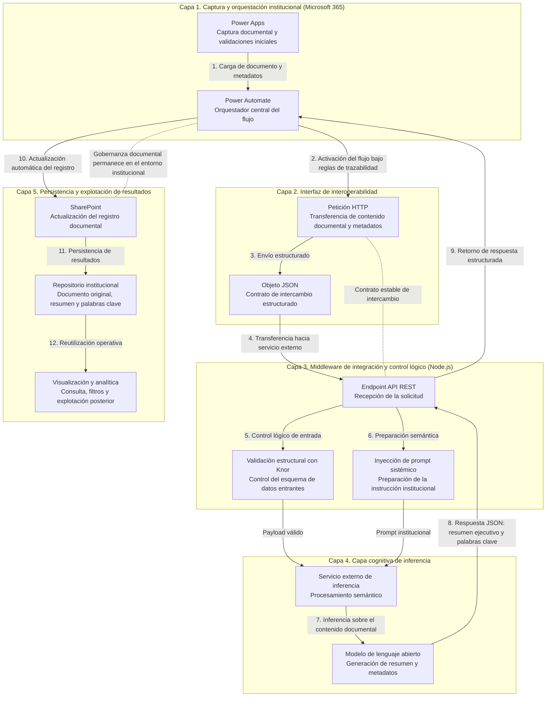
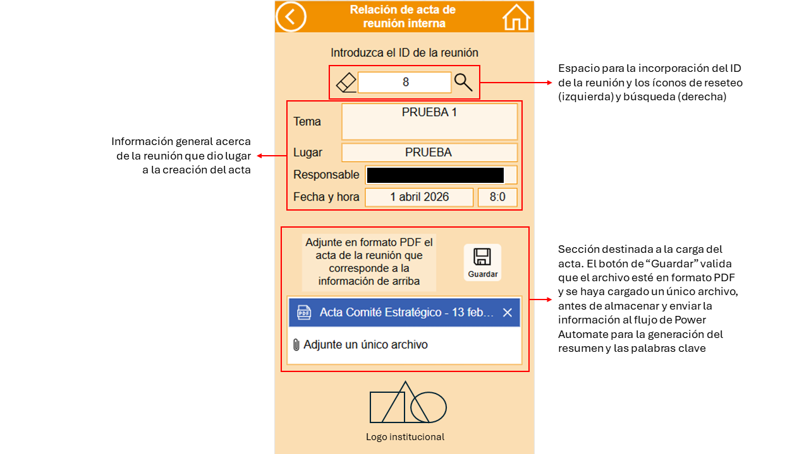
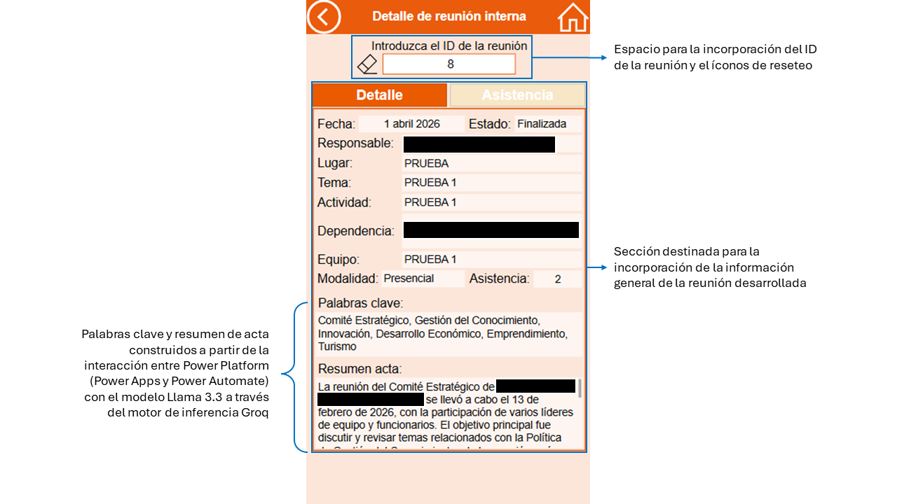
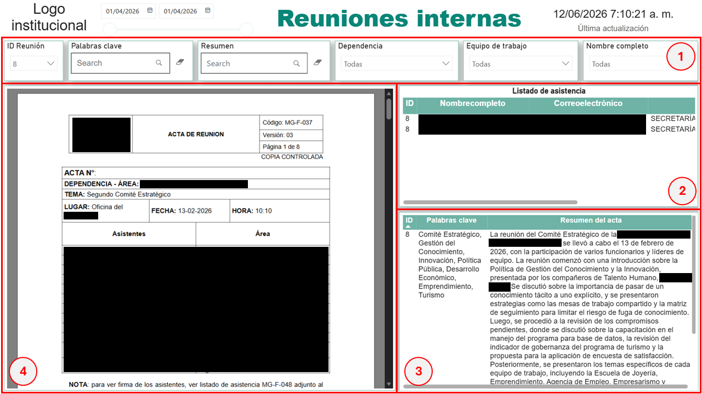

# 🏛️ Material Complementario (Anexo Técnico)

# Innovación pública mediante IA generativa: arquitecturas desacopladas para la gestión documental territorial


## Nota metodológica

El presente documento constituye el **material complementario (anexo técnico)** asociado al artículo *Innovación pública mediante IA generativa: arquitecturas desacopladas para la gestión documental territorial*. Su propósito es proporcionar evidencia técnica adicional que respalde el diseño, implementación y validación del artefacto desarrollado en la investigación.

De acuerdo con los principios de transparencia y trazabilidad propios de la investigación basada en diseño (*Design Science Research*), este material complementa la información contenida en el manuscrito mediante diagramas arquitectónicos, evidencias visuales de la solución implementada, descripciones de los componentes tecnológicos, fragmentos representativos de configuración y resultados de validación funcional. Su finalidad no es sustituir la explicación metodológica o conceptual del artículo principal, sino facilitar la comprensión de aquellos elementos técnicos cuya descripción detallada excede el alcance habitual de una publicación científica.

Con el fin de proteger la seguridad de la infraestructura tecnológica utilizada durante la implementación y garantizar el cumplimiento de las disposiciones aplicables en materia de protección de datos, gestión documental y ciberseguridad institucional, el material presentado ha sido sanitizado. En consecuencia, se han eliminado o anonimizado credenciales, direcciones de infraestructura, identificadores organizacionales, datos personales y componentes sensibles del código fuente. Los ejemplos incluidos conservan la lógica funcional del artefacto y permiten comprender su operación sin comprometer activos de información de la entidad.

El material complementario se encuentra organizado en cinco apartados:

1. **Arquitectura general del artefacto y flujo de datos.**
2. **Evidencias de interacción y captura documental.**
3. **Evidencia técnica del microservicio de integración y procesamiento semántico.**
4. **Visualización y explotación analítica de resultados.**
5. **Evidencias de validación funcional del artefacto.**

Cada una de estas secciones se encuentra vinculada explícitamente con los apartados correspondientes del manuscrito, permitiendo establecer una relación directa entre las decisiones de diseño, los mecanismos de implementación y los resultados obtenidos durante la evaluación del sistema.

---

# 1. Arquitectura general del artefacto

La solución propuesta se implementó mediante una arquitectura desacoplada orientada al procesamiento automatizado de documentos administrativos. El diseño distribuye las responsabilidades funcionales entre diferentes capas especializadas, permitiendo separar la captura documental, la integración, el procesamiento semántico y la explotación analítica de los resultados. La arquitectura fue concebida para minimizar las dependencias entre componentes y facilitar la incorporación de servicios especializados sin modificar los entornos institucionales preexistentes. Esta propiedad permite mantener la gobernanza documental dentro del ecosistema corporativo, mientras que las capacidades de procesamiento semántico operan en capas independientes y desacopladas.

### Figura 1. 
### _Arquitectura general del artefacto_


# 2. Evidencias de interacción y captura documental

La capa de interacción constituye el punto de entrada del artefacto y concentra las funciones de captura documental, validación preliminar y visualización de resultados. Su diseño se orientó a mantener toda la experiencia de uso dentro del entorno institucional de Microsoft 365, evitando que los usuarios debieran interactuar directamente con componentes externos o servicios especializados de procesamiento semántico.

---

## 2.1. Captura documental y validación preliminar

La interfaz de captura fue desarrollada en Power Apps y actúa como la primera capa de control del flujo documental. Su propósito consiste en recibir los documentos proporcionados por los usuarios autorizados y verificar el cumplimiento de las condiciones mínimas necesarias para su procesamiento posterior.

### Figura 2. 
### _Interfaz de captura y validación documental_


---

## 2.2. Visualización de resultados documentales

Una vez completado el procesamiento documental, la información generada por la arquitectura retorna al entorno institucional y es presentada al usuario mediante la propia interfaz de Power Apps. Esta estrategia permite mantener la experiencia de interacción dentro de un único entorno de trabajo y evita que los usuarios deban consultar sistemas externos para acceder a los resultados.

### Figura 3. 
### _Visualización de resultados estructurados_


---

## 2.3. Escenarios operativos del flujo de integración

Durante las fases de validación se observaron diferentes comportamientos asociados al estado operativo del entorno de ejecución utilizado por el microservicio de integración.

Las evidencias presentadas a continuación ilustran escenarios representativos de ejecución del flujo documental bajo distintas condiciones operativas. En algunos casos se identificaron incrementos temporales en los tiempos de respuesta asociados a fenómenos de activación del entorno de ejecución (*Cold Start*), mientras que en otros escenarios la disponibilidad previa del servicio permitió respuestas más rápidas.

Estos registros deben interpretarse como ejemplos ilustrativos del comportamiento observado durante la validación funcional y no como mediciones experimentales controladas de rendimiento.

La estrategia implementada para mitigar este comportamiento se describe posteriormente en la Sección 3.4 del presente anexo y en la subsección 4.5 del manuscrito.

### Figura 4. 
### _Escenarios operativos del flujo de ejecución_


---

# 3. Evidencia técnica del microservicio de integración y procesamiento semántico

La presente sección documenta los componentes técnicos más relevantes del microservicio de integración utilizado durante la implementación del artefacto. Su objetivo consiste en proporcionar evidencia complementaria de los mecanismos empleados para validar la información intercambiada entre sistemas, parametrizar el modelo fundacional y garantizar la consistencia estructural de los resultados generados.

---

## 3.1. Validación estructural de datos mediante Knor

Antes de iniciar cualquier proceso de inferencia, el microservicio verifica que la información procedente del flujo institucional cumpla con una estructura de datos previamente definida. Esta validación tiene como propósito preservar la integridad de la transacción y evitar el procesamiento de solicitudes incompletas o inconsistentes.

Para ello se implementó la librería **Knor**, utilizada como mecanismo de validación de esquemas JSON en el punto de entrada del servicio.

### Figura 5.
### _Fragmento representativo de validación estructural_
```javascript
const { k } = require('knor');

const actaSchema = k.object({
    idActa: k.string().required(),
    fechaComite: k.string().required(),
    textoExtraido: k.string().min(100).required(),
    usuarioRemitente: k.string().email()
});

function validarPayload(req, res, next) {
    const validacion = actaSchema.validate(req.body);

    if (!validacion.isValid) {
        return res.status(400).json({
            error: "Estructura de datos inválida",
            detalles: validacion.errors
        });
    }

    next();
}
```

La validación estructural permite asegurar la compatibilidad entre la información enviada desde Power Automate y los requisitos definidos para el procesamiento documental posterior.

---

## 3.2. Parametrización mediante prompt engineering

El comportamiento del modelo fundacional fue controlado mediante instrucciones explícitas orientadas al dominio documental de la administración pública.

Estas instrucciones fueron implementadas mediante un *system prompt* que define:

- El rol funcional del modelo.
- Los productos esperados de la inferencia.
- Las restricciones de formato.
- La estructura de la respuesta devuelta al sistema.

### Figura 6.
### _Fragmento representativo del prompt sistémico_
```javascript
const construirPromptSistemico = () => {
    return `
    Actúas como un analista documental institucional.

    Reglas obligatorias:

    1. Genera un resumenEjecutivo.
    2. Identifica compromisos relevantes.
    3. Extrae palabrasClave para indexación documental.

    Restricción:
    Debes responder exclusivamente mediante un objeto JSON válido.
    `;
};
```

La parametrización utilizada tuvo como finalidad favorecer la consistencia estructural de la salida y facilitar su posterior integración con los repositorios documentales institucionales.

---

## 3.3. Integración con el servicio de inferencia

Una vez validada la estructura de entrada y construido el contexto de procesamiento, el microservicio establece una comunicación asíncrona con el servicio de inferencia encargado de ejecutar el análisis semántico del documento.

La interacción se realiza mediante solicitudes HTTP estructuradas que incluyen:

- El contenido documental.
- Las instrucciones del sistema.
- Los parámetros de configuración del modelo.
- Los mecanismos de control de formato de respuesta.

### Figura 7.
### _Fragmento representativo de integración_
```javascript
const payload = {
    model: "MODELO_UTILIZADO",
    messages: [
        {
            role: "system",
            content: construirPromptSistemico()
        },
        {
            role: "user",
            content: textoActa
        }
    ],
    temperature: 0.1,
    response_format: {
        type: "json_object"
    }
};
```

La utilización de una temperatura reducida y de un formato de respuesta estructurado tuvo como objetivo favorecer la estabilidad operativa del flujo y garantizar la compatibilidad de los resultados con las etapas posteriores del sistema.

---

## 3.4. Estrategia de disponibilidad y mitigación del fenómeno Cold Start

Durante las pruebas de validación se identificó la existencia de incrementos temporales en los tiempos de respuesta cuando el entorno de ejecución permanecía inactivo durante periodos prolongados. Con el fin de mitigar este comportamiento, se implementó una estrategia de disponibilidad basada en activaciones periódicas del servicio mediante **ConsoleCron**. La lógica de funcionamiento consiste en realizar solicitudes de bajo impacto al entorno de ejecución a intervalos regulares para evitar estados prolongados de suspensión.

### Figura 8. 
### _Ejemplo conceptual de configuración_
```text
Nombre del Job:
Keep-Alive-Middleware

Frecuencia:
*/10 * * * *

Método:
GET

Endpoint:
https://[ENDPOINT_SANITIZADO]/ping
```

Esta estrategia no participa directamente en el procesamiento documental ni modifica la lógica de inferencia. Su propósito es exclusivamente operativo y está orientado a mejorar la continuidad del servicio durante periodos de baja utilización.

# 4. Visualización y explotación analítica de resultados

El agrupamiento esquematizado de la información favorece la consulta de resultados históricos, especialmente a la hora de asignar filtros de búsqueda que permiten la extracción de datos puntuales, sin importar que tan antiguos sean y sin la necesidad de aludir a la memoria humana para llegar a ellos. Este panel de visualización ubica la sección de filtros por categorías especiales y tiempo que favorecen la búsqueda histórica y relevante de actas o metadatos (resúmenes y palabras clave) almacenados en los repositorios. En la Figura 9, el **recuadro 1** contiene los filtros que permiten la búsqueda histórica de la reunión con su respectiva acta, bien sea por el ID, algún texto específico en el resumen o las palabras clave, la dependencia, el equipo de trabajo o el nombre del funcionario responsable de la reunión. El **recuadro 2** muestra el listado de asistencia de los participantes a la reunión muestra el listado de asistencia a la reunión. El **recuadro 3** deja ver el resumen y las palabras clave extraídas generadas por el modelo Llama 3.3 a través del motor de inferencia Groq. El **recuadro 4** permite visualizar el documento original almacenado en el repositorio de datos en SharePoint de Microsoft 365.

### Figura 9. 
### _Entorno de visualización y explotación analítica_


---

# 5. Evidencias de validación funcional del artefacto

La presente sección documenta las evidencias de validación funcional utilizadas durante la evaluación del artefacto. Su propósito consiste en proporcionar soporte empírico complementario a los resultados presentados en el manuscrito, describiendo los principales escenarios de prueba implementados, los mecanismos de control aplicados y los resultados generales observados durante la validación.

---
## 5.1. Prueba de rendimiento y tolerancia a fallos

La Tabla 1 presenta los documentos utilizados durante la validación funcional del artefacto, incluyendo el tamaño del archivo, características físicas del soporte documental, tiempos de preprocesamiento, latencia transaccional extremo a extremo y resultado final de la generación automática del resumen. Los casos fallidos corresponden a documentos con limitaciones en la fase de captura y extracción óptica de texto, particularmente en soportes impresos sobre papel color beige o con contenido manuscrito. Para estos casos, aunque el proceso no reportó un problema debido a que logró extraer algunos datos parciales, los resúmenes resaltaron la inconsistencia de los datos enviados.

### Tabla 1. 
### _Matriz de rendimiento y tolerancia a fallos del banco de pruebas documental (N = 30)_
| ID | Nombre del archivo | Tamaño (Kb) | Característica física | Grupo | Hora de envío | Tiempo de preprocesamiento (ms) | Hora de recepción | Duración (ms) | Duración (s) | ¿Realizó resumen? |
|:--:|-------------------|:-----------:|------------------------|--------|---------------|:------------------------------:|------------------|:-------------:|:------------:|------------------|
| 14 | 20230626 Acta 1 | 2.926 | Documento impreso en papel color beige | Acta | 16:15:34 | 271 | 16:15:37 | 2.729 | 2,73 | No |
| 15 | 20240216 Acta 5 | 976 | Documento impreso en papel color beige escrito a mano | Acta | 16:26:35 | 174 | 16:26:37 | 1.826 | 1,83 | No |
| 16 | 20240712 Acta 9 | 145 | Documento digitalizado | Acta | 16:37:51 | 115 | 16:37:53 | 1.885 | 1,89 | Sí |
| 17 | 20241217 Acta 14 | 813 | Documento digitalizado | Acta | 16:38:28 | 363 | 16:38:31 | 2.637 | 2,64 | Sí |
| 18 | Acta 07 | 677 | Documento impreso en papel color beige | Acta | 16:40:46 | 141 | 16:40:48 | 1.859 | 1,86 | No |
| 19 | ACTA 1 | 1.320 | Documento digitalizado | Acta | 16:55:32 | 98 | 16:55:34 | 1.902 | 1,90 | Sí |
| 20 | ACTA 4. | 1.173 | Documento digitalizado | Acta | 16:56:40 | 206 | 16:56:43 | 2.794 | 2,79 | Sí |
| 21 | Acta 08 | 281 | Documento digitalizado | Acta | 17:59:14 | 99 | 17:59:15 | 901 | 0,90 | Sí |
| 22 | Acta 14 | 461 | Documento digitalizado | Acta | 18:01:02 | 180 | 18:01:04 | 1.820 | 1,82 | Sí |
| 23 | Acta Comité Interno PP Turismo Sept. 30 2024 | 1.370 | Documento digitalizado | Acta | 18:02:12 | 90 | 18:02:16 | 3.910 | 3,91 | Sí |
| 24 | 3 CC-F-239 Solicitud de Adquisiciones - Rev. | 269 | Documento digitalizado | Legal | 18:04:56 | 105 | 18:04:59 | 2.895 | 2,90 | Sí |
| 25 | 110-20261032 DLLO ECONÓMICO 1439 | 32 | Documento impreso en papel color blanco | Legal | 18:05:33 | 89 | 18:05:35 | 1.911 | 1,91 | Sí |
| 26 | Cambio Supervisor Mayo 25 Zona 2. | 322 | Documento digitalizado | Legal | 18:07:01 | 124 | 18:07:03 | 1.876 | 1,88 | Sí |
| 27 | CC-F-044 Designación Supervisor (1) (1) (9) | 135 | Documento digitalizado | Legal | 18:10:21 | 104 | 18:10:23 | 1.896 | 1,90 | Sí |
| 28 | CC-F-194 Clausulado Anexo (Persona Jurídica) (2) (7) | 408 | Documento digitalizado | Legal | 18:23:28 | 82 | 18:23:31 | 2.918 | 2,92 | Sí |
| 29 | Clausulado anexo convenios de asociación | 742 | Documento digitalizado | Legal | 18:24:43 | 121 | 18:24:46 | 2.879 | 2,88 | Sí |
| 30 | CLAUSULADO | 454 | Documento digitalizado | Legal | 18:25:19 | 121 | 18:25:22 | 2.879 | 2,88 | Sí |
| 31 | Inexistencia Inglés para el trabajo | 157 | Documento digitalizado | Legal | 18:26:36 | 86 | 18:26:37 | 914 | 0,91 | Sí |
| 32 | INFORME 03-02 A 04-01 | 340 | Documento digitalizado | Legal | 18:27:40 | 143 | 18:27:43 | 2.857 | 2,86 | Sí |
| 33 | INFORME DE SUPERVISIÓN ACTA 05 | 269 | Documento digitalizado | Legal | 18:28:58 | 136 | 18:29:01 | 2.864 | 2,86 | Sí |
| 34 | Circular 20260000047 | 433 | Documento digitalizado | Variado | 21:04:32 | 220 | 21:04:33 | 780 | 0,78 | Sí |
| 35 | CIRCULAR ELECCIÓN COMISIÓN DE PERSONAL-2026 | 523 | Documento digitalizado | Variado | 21:06:10 | 103 | 21:06:12 | 1.897 | 1,90 | Sí |
| 36 | Decreto municipal número 20260000500 de marzo 27 de 2026 | 5.581 | Documento digitalizado | Variado | 21:09:22 | 106 | 21:09:26 | 3.894 | 3,89 | Sí |
| 37 | Derecho de Petición | 157 | Documento digitalizado | Variado | 21:11:02 | 112 | 21:11:03 | 888 | 0,89 | Sí |
| 38 | DocModeloInclusion_NOV2025 | 9.230 | Documento digitalizado | Variado | 21:12:13 | 118 | 21:12:18 | 4.882 | 4,88 | Sí |
| 39 | IA para la productividad | 12.707 | Presentación gráfica digitalizada | Variado | 21:14:19 | 97 | 21:14:25 | 5.903 | 5,90 | Sí |
| 40 | Informe SDE (3) | 1.493 | Documento digitalizado | Variado | 21:15:50 | 97 | 21:15:53 | 2.903 | 2,90 | Sí |
| 41 | M S E CV ATS | 69 | Documento digitalizado | Variado | 21:17:19 | 97 | 21:17:20 | 903 | 0,90 | Sí |
| 42 | REGLAMENTO DE PRESTACIÓN DE SERVICIOS (2) | 1.068 | Documento digitalizado | Variado | 08:23:19 | 176 | 08:23:22 | 2.824 | 2,82 | Sí |
| 43 | Segundo_Auto_de_pruebas_T-11.443.237_anonimizado_100426 | 374 | Documento digitalizado | Variado | 08:24:33 | 96 | 08:24:36 | 2.904 | 2,90 | Sí |

_Nota_: La tabla hace alusión al comportamiento operativo de los procesos 3 a 9 referenciados en la Figura 1. El tiempo de duración se calculó bajo la siguiente lógica: (Hora de recepción - Hora de envío) - Tiempo de preprocesamiento. El último ítem se involucra en la medición, pues es un proceso que se surte en la plataforma Power Automate para enviar el documento procesado como Objeto JSON. 

---
## 5.2. Evaluación semántica del modelo Llamma 3.3

La evaluación semántica de los documentos permitió establecer la pertinencia del artefacto de cara a los usuarios que se verían beneficiados en su implementación de acuerdo con las características incluídas en las tablas 2 y 3.

### Tabla 2. 
### _Evaluación semántica de resúmenes y palabras clave (muestra completa, N = 30)_
| Documento ID | Exactitud | Completitud | Claridad | Palabras clave | Utilidad institucional |
|-------------|----------:|------------:|---------:|---------------:|----------------------:|
| 22 | 5,0 | 5,0 | 5,0 | 5,0 | 5,0 |
| 32 | 5,0 | 5,0 | 5,0 | 5,0 | 5,0 |
| 42 | 5,0 | 5,0 | 5,0 | 5,0 | 5,0 |
| 19 | 4,3 | 4,7 | 4,7 | 4,7 | 4,3 |
| 16 | 5,0 | 5,0 | 5,0 | 5,0 | 5,0 |
| 26 | 5,0 | 5,0 | 5,0 | 5,0 | 5,0 |
| 36 | 5,0 | 5,0 | 5,0 | 5,0 | 5,0 |
| 14 | 1,0 | 1,0 | 1,0 | 1,0 | 1,0 |
| 24 | 5,0 | 5,0 | 5,0 | 5,0 | 5,0 |
| 34 | 5,0 | 5,0 | 5,0 | 5,0 | 5,0 |
| 29 | 4,7 | 5,0 | 5,0 | 5,0 | 4,7 |
| 17 | 5,0 | 5,0 | 5,0 | 4,7 | 5,0 |
| 27 | 4,0 | 4,0 | 4,0 | 4,7 | 4,0 |
| 18 | 1,0 | 1,0 | 1,0 | 1,0 | 1,0 |
| 28 | 5,0 | 5,0 | 5,0 | 5,0 | 5,0 |
| 37 | 5,0 | 5,0 | 5,0 | 5,0 | 5,0 |
| 38 | 5,0 | 5,0 | 5,0 | 5,0 | 5,0 |
| 21 | 4,7 | 4,7 | 5,0 | 5,0 | 5,0 |
| 31 | 5,0 | 5,0 | 5,0 | 5,0 | 5,0 |
| 41 | 4,7 | 5,0 | 5,0 | 4,3 | 3,7 |
| 39 | 4,3 | 4,0 | 4,3 | 4,3 | 4,3 |
| 20 | 5,0 | 5,0 | 5,0 | 5,0 | 5,0 |
| 30 | 5,0 | 5,0 | 5,0 | 5,0 | 5,0 |
| 40 | 5,0 | 5,0 | 5,0 | 5,0 | 5,0 |
| 15 | 1,3 | 1,0 | 1,0 | 1,7 | 2,3 |
| 25 | 5,0 | 5,0 | 5,0 | 5,0 | 5,0 |
| 35 | 5,0 | 5,0 | 5,0 | 5,0 | 5,0 |
| 23 | 4,7 | 5,0 | 4,7 | 5,0 | 5,0 |
| 33 | 4,7 | 4,7 | 4,7 | 4,7 | 5,0 |
| 43 | 5,0 | 5,0 | 5,0 | 5,0 | 5,0 |
| **Promedio general** | **4,5** | **4,5** | **4,5** | **4,5** | **4,5** |

_Nota._ Resultados de la evaluación semántica realizada por diez funcionarios de la entidad mediante una escala Likert de cinco puntos. Cada documento fue valorado por tres evaluadores independientes. La tabla incluye la totalidad de la muestra, incorporando los documentos que no lograron completar satisfactoriamente el proceso de extracción y resumen debido a limitaciones en la fase de captura documental.

### Tabla 3. 
### _Evaluación semántica de resúmenes y palabras clave (muestra completa, N = 30)_
| Documento ID | Exactitud | Completitud | Claridad | Palabras clave | Utilidad institucional |
|-------------|----------:|------------:|---------:|---------------:|----------------------:|
| 22 | 5,0 | 5,0 | 5,0 | 5,0 | 5,0 |
| 32 | 5,0 | 5,0 | 5,0 | 5,0 | 5,0 |
| 42 | 5,0 | 5,0 | 5,0 | 5,0 | 5,0 |
| 19 | 4,3 | 4,7 | 4,7 | 4,7 | 4,3 |
| 16 | 5,0 | 5,0 | 5,0 | 5,0 | 5,0 |
| 26 | 5,0 | 5,0 | 5,0 | 5,0 | 5,0 |
| 36 | 5,0 | 5,0 | 5,0 | 5,0 | 5,0 |
| 24 | 5,0 | 5,0 | 5,0 | 5,0 | 5,0 |
| 34 | 5,0 | 5,0 | 5,0 | 5,0 | 5,0 |
| 29 | 4,7 | 5,0 | 5,0 | 5,0 | 4,7 |
| 17 | 5,0 | 5,0 | 5,0 | 4,7 | 5,0 |
| 27 | 4,0 | 4,0 | 4,0 | 4,7 | 4,0 |
| 28 | 5,0 | 5,0 | 5,0 | 5,0 | 5,0 |
| 37 | 5,0 | 5,0 | 5,0 | 5,0 | 5,0 |
| 38 | 5,0 | 5,0 | 5,0 | 5,0 | 5,0 |
| 21 | 4,7 | 4,7 | 5,0 | 5,0 | 5,0 |
| 31 | 5,0 | 5,0 | 5,0 | 5,0 | 5,0 |
| 41 | 4,7 | 5,0 | 5,0 | 4,3 | 3,7 |
| 39 | 4,3 | 4,0 | 4,3 | 4,3 | 4,3 |
| 20 | 5,0 | 5,0 | 5,0 | 5,0 | 5,0 |
| 30 | 5,0 | 5,0 | 5,0 | 5,0 | 5,0 |
| 40 | 5,0 | 5,0 | 5,0 | 5,0 | 5,0 |
| 25 | 5,0 | 5,0 | 5,0 | 5,0 | 5,0 |
| 35 | 5,0 | 5,0 | 5,0 | 5,0 | 5,0 |
| 23 | 4,7 | 5,0 | 4,7 | 5,0 | 5,0 |
| 33 | 4,7 | 4,7 | 4,7 | 4,7 | 5,0 |
| 43 | 5,0 | 5,0 | 5,0 | 5,0 | 5,0 |
| **Promedio general** | **4,9** | **4,9** | **4,9** | **4,9** | **4,9** |

_Nota._ Resultados de la evaluación semántica considerando únicamente los documentos cuyo procesamiento fue exitoso. La eliminación de los casos fallidos (14, 15 y 18) permite aislar el desempeño del modelo de lenguaje de las limitaciones asociadas a la captura y extracción óptica del texto original. La valoración promedio de 4,9 sobre 5 indica una percepción altamente favorable de los usuarios respecto a la exactitud, completitud, claridad, pertinencia de las palabras clave y utilidad institucional de los resúmenes generados por el artefacto.

---
## 5.3. Casos de prueba y validación funcional

Como parte del proceso de evaluación se definieron escenarios de prueba orientados a validar los principales componentes de la arquitectura.

Los casos considerados abarcaron:

- Validación de restricciones en la interfaz de captura.
- Integridad de la información intercambiada entre sistemas.
- Comportamiento del microservicio frente a solicitudes inválidas.
- Estabilidad del procesamiento documental.
- Controles básicos de acceso a los servicios expuestos.

La Tabla A1 resume los escenarios representativos utilizados durante las pruebas.

### Tabla 4. 
### _Escenarios de validación funcional_
| ID | Componente | Escenario evaluado | Resultado esperado | Resultado observado | Estado |
|----------|----------|----------|----------|----------|----------|
| QA-01 | Interfaz de captura | Carga de archivo con formato no admitido | Bloqueo de la operación y notificación al usuario | Restricción aplicada correctamente | ✅ |
| QA-02 | Validación estructural | Envío de solicitud con información incompleta | Rechazo de la transacción | Solicitud rechazada mediante validación estructural | ✅ |
| QA-03 | Procesamiento documental | Documento extenso con contenido textual válido | Generación de respuesta estructurada | Procesamiento completado satisfactoriamente | ✅ |
| QA-04 | Control de acceso | Solicitud sin credenciales válidas | Denegación de acceso al servicio | Acceso restringido correctamente | ✅ |